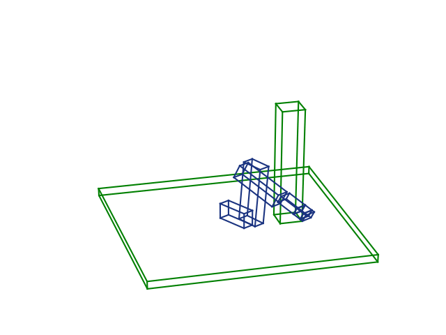

[](https://travis-ci.org/JeroenDM/acrobotics) [](https://codecov.io/gh/JeroenDM/acrobotics) [](https://badge.fury.io/py/acrobotics)

# Acrobotics

Quickly test motion planning ideas is the goal, and Python seems like a great language for rapid prototyping. There are great libraries for robot simulation and related task, but installing them is can be a hassle and very dependent on operating system and python version.
The drawback is that I have to write a lot of stuff myself. I'm not sure if it is useful to do this. But it will be fun and I will learn a bunch.

This library provides robot kinematics and collision checking for serial kinematic chains. The idea is that this library can be easily swapped by another one providing the same functionality.

The acro part comes from [ACRO](https://iiw.kuleuven.be/onderzoek/acro) a robotics research group at KU Leuven in Belgium.

## Installation

```bash
pip install acrobotics
```

Or for development

```bash
git clone https://github.com/JeroenDM/acrobotics.git
cd acrobotics
python setup.py develop
```

No Windows support for the moment because [python-fcl](https://pypi.org/project/python-fcl/) is not supported. :(
In the future I will possibly switch to [pybullet](https://pypi.org/project/pybullet/). In the meantime, use [windows subsystem for linux](https://docs.microsoft.com/en-us/windows/wsl/install-win10). MacOS is not tested yet.

## Gettings started

(Code for example below: [examples/getting_started.py](examples/getting_started.py))

This library has three main tricks.

### Robot kinematics
`T = robot.fk(joint_values)`
`IKSolution = robot.ik(T)`

Forward kinematics are implemented in a generic `RobotKinematics` class.
```python
import acrobotics as ab

robot = ab.Kuka()

joint_values = [0.1, 0.2, 0.3, 0.4, 0.5, 0.6]
T_fk = robot.fk(joint_values)
```

Analytical inverse kinematics only for specific robots:
```python
ik_solution = robot.ik(T_fk)  # T_fk is a numpy 4x4 array

print(f"Inverse kinematics successful? {ik_solution.success}")
for q in ik_solution.solutions:
    print(q)
```
```bash
Inverse kinematics successful? True
[ 0.1        -1.0949727   2.84159265  2.87778828  0.79803563 -1.99992985]
[ 0.1        -1.0949727   2.84159265 -0.26380438 -0.79803563  1.1416628 ]
[0.1 0.2 0.3 0.4 0.5 0.6]
[ 0.1         0.2         0.3        -2.74159265 -0.5        -2.54159265]
```

### Collision checking
`bool = robot.is_in_collision(joint_values, planning_scene)`

First create a planning scene with obstacles the robot can collide with.
```python
from acrolib.geometry import translation

table = ab.Box(2, 2, 0.1)
T_table = translation(0, 0, -0.2)

obstacle = ab.Box(0.2, 0.2, 1.5)
T_obs = translation(0, 0.5, 0.55)

scene = ab.Scene([table, obstacle], [T_table, T_obs])
```

Then create a list of robot configurations for wich you want to check collision with the planning scene.
```python
import numpy as np

q_start = np.array([0.5, 1.5, -0.3, 0, 0, 0])
q_goal = np.array([2.5, 1.5, 0.3, 0, 0, 0])
q_path = np.linspace(q_start, q_goal, 10)
```

And then you could do:
```python
print([robot.is_in_collision(q, scene) for q in q_path])
```
```bash
[False, False, False, False, True, True, True, True, False, False]
```

### Visualization
`robot.plot(axes_handle, joint_values)`
`robot.animate_path(figure_handle, axes_handle, joint_path)`

```python
from acrolib.plotting import get_default_axes3d

fig, ax = get_default_axes3d()

scene.plot(ax, c="green")
robot.animate_path(fig, ax, q_path)
```



## More details

There's a more in depth explanation in the jupyter-notebooks in the examples folder.

Most of the usefull stuff can be imported similar to common numpy usage:
```Python
import acrobotics as ab
```
For more advanced classes, such as `Robot` to create a custom robot, you have to explicitly import them:
```Python
from acrobotics.robot import Robot
from acrobotics.link import DHLink, JointType, Link
```

## And motion planning?

The package implements a basic sampling-based and optimization-based planner. Examples on how to use them can be found in the test folder, in [test_planning_sampling_based.py](tests/test_planning_optimization_based.py) and [test_planning_optimization_based.py](tests/test_planning_optimization_based.py). However, there is a non-trivial amount of setting types you have to supply to get it working. These appeared after a major refactor in an attempt to make to code more maintainable, but we went a bit overboard in the settings department...
